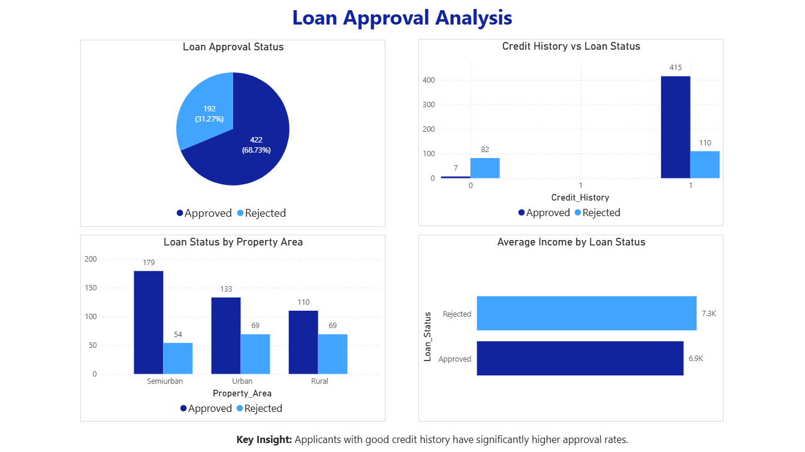

# Loan Approval Analysis Dashboard

## Overview
This project analyzes loan approval data to identify key factors influencing loan approval decisions.

## Tools Used
- Microsoft Excel
- SQL
- Power BI

## Process
- Cleaned and prepared data using Excel
- Performed data analysis using SQL queries
- Built an interactive dashboard in Power BI

## Key Insights
- Credit history is the most important factor affecting loan approval
- Higher income increases chances of loan approval
- Semiurban areas have higher approval rates

## Dashboard
